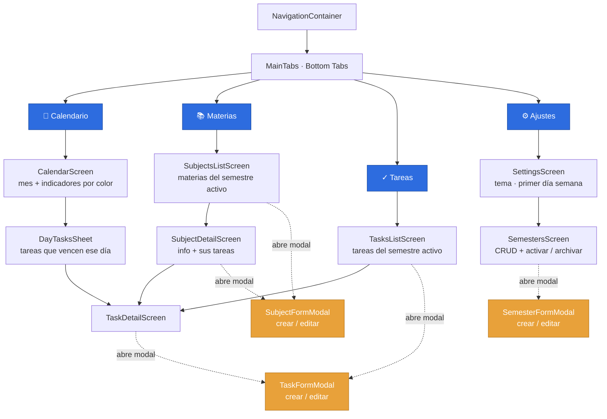
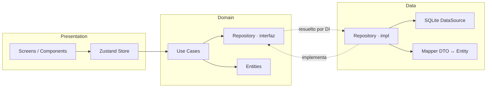

# Calendar Memory — Arquitectura y Diseño

> Cómo está construida la app para cumplir [REQUIREMENTS.md](./REQUIREMENTS.md).
> App individual, un solo dispositivo, offline-first. **Sin autenticación.**

---

## 1. Decisiones de base

| Decisión | Elección | Por qué |
|----------|----------|---------|
| Autenticación | **Ninguna** | Un usuario, un dispositivo. Auth sería fricción sin valor. |
| Arquitectura | **Clean Architecture por capas** (data / domain / presentation) | Aísla reglas de negocio de la UI y de SQLite; testeable y sustituible. |
| Persistencia | **SQLite** (datos) + **MMKV** (preferencias) | Integridad referencial y consultas indexadas; MMKV para clave-valor rápido. |
| Navegación | **React Navigation** (Native Stack + Bottom Tabs) | Estándar de facto, tipado con TypeScript. |
| Estado UI | **Zustand** por feature | Ligero, sin boilerplate; los stores llaman a los *use cases*. |
| Inyección | **Contenedor DI manual** en `core/di` | Provee repositorios/use cases; permite mockear en tests. |
| Errores | **Result/Either** (`core/errors`) | Errores explícitos sin excepciones que crucen capas. |

---

## 2. Mapa de navegación

Sin login, la app abre directo en las pestañas. El **semestre activo** es el contexto global (se elige en Ajustes → Semestres) y filtra todo lo que se ve en Calendario, Materias y Tareas.



### Estructura de navegadores

```
RootStack (Native Stack)
├── MainTabs (Bottom Tabs)          ← pantalla principal
│   ├── CalendarStack
│   │   └── CalendarScreen
│   ├── SubjectsStack
│   │   ├── SubjectsListScreen
│   │   └── SubjectDetailScreen
│   ├── TasksStack
│   │   ├── TasksListScreen
│   │   └── TaskDetailScreen
│   └── SettingsStack
│       ├── SettingsScreen
│       └── SemestersScreen
└── Modales (presentation: 'modal')
    ├── SemesterFormModal   (create | edit)
    ├── SubjectFormModal    (create | edit)
    └── TaskFormModal       (create | edit)
```

**Por qué modales para los formularios:** crear/editar es una acción transversal que se lanza desde varias pantallas (una tarea se crea desde Tareas, desde el detalle de una materia y desde un día del calendario). Un modal compartido evita duplicar el formulario en cada stack.

### Tipado de rutas (React Navigation + TS)

```ts
// src/app/navigation/types.ts
export type RootStackParamList = {
  MainTabs: undefined;
  SemesterFormModal: { semesterId?: string };   // undefined id = crear
  SubjectFormModal: { subjectId?: string };
  TaskFormModal: { taskId?: string; subjectId?: string; dueDate?: string };
};

export type TabParamList = {
  Calendar: undefined;
  Subjects: undefined;
  Tasks: undefined;
  Settings: undefined;
};
```

---

## 3. Capas y flujo de datos

Regla de dependencia: **presentation → domain ← data**. El dominio no conoce a nadie; data y presentation dependen de él.



**Flujo de una acción** (ej. "marcar tarea como hecha"):
1. `TaskCard` llama a `useTasksStore().toggleDone(id)`.
2. El store invoca el use case `UpdateTaskStatus`.
3. El use case pide al `TaskRepository` (interfaz) actualizar.
4. La impl del repo llama al `TaskDataSource` (SQL `UPDATE`) y mapea el resultado a entidad.
5. Devuelve `Result<Task>`; el store actualiza su estado y la UI re-renderiza.

---

## 4. Patrones de diseño aplicados

| Patrón | Dónde | Qué resuelve |
|--------|-------|--------------|
| **Repository** | `domain/repositories` (interfaz) + `data/.../repositories` (impl) | La UI y los use cases no saben que detrás hay SQLite; se puede cambiar el motor o mockear en tests. |
| **Use Case (Interactor)** | `domain/usecases` | Una acción de negocio = una clase/función con un solo propósito (`CreateTask`, `ArchiveSemester`). Reglas de negocio en un solo lugar. |
| **Mapper** | `data/.../mappers` | Traduce filas SQL (DTO) ↔ entidades de dominio. Aísla el esquema de BD del modelo de negocio. |
| **Data Source** | `data/.../datasources` | Encapsula el SQL crudo; el repo solo orquesta. |
| **Dependency Injection (Service Locator)** | `core/di/container.ts` | Construye y cablea datasources → repos → use cases una sola vez; se inyectan vía `AppProviders`. |
| **Result / Either** | `core/errors/result.ts` | Manejo de errores explícito (`Ok`/`Err`) sin try/catch cruzando capas. |
| **Provider (Context)** | `app/providers` | Expone el contenedor DB/DI, tema y semestre activo a todo el árbol. |
| **Store por feature (Facade)** | `presentation/store` (Zustand) | Fachada de estado para la UI; oculta los use cases tras acciones simples. |
| **Adapter** | `core/storage` | Envuelve SQLite y MMKV tras interfaces propias (`Database`, `KeyValueStore`). |
| **Migration** | `core/storage/migrations` | Versionado del esquema; evolución sin perder datos. |

---

## 5. Modelo de dominio

```ts
// domain/entities
type Semester = {
  id: string;
  name: string;            // "2026-1"
  startDate: string;       // ISO
  endDate: string;
  isActive: boolean;       // solo uno activo
  isArchived: boolean;
};

type Subject = {
  id: string;
  semesterId: string;      // FK
  name: string;
  code?: string;
  color: string;           // pinta el calendario
  professor?: string;
  credits?: number;
};

type TaskStatus = 'pending' | 'in_progress' | 'done';
type Priority = 'low' | 'medium' | 'high';

type Task = {
  id: string;
  subjectId: string;       // FK → materia (→ semestre por transitividad)
  title: string;
  description?: string;
  dueDate?: string;        // ISO; opcional
  status: TaskStatus;
  priority: Priority;
};
```

---

## 6. Esquema SQLite

```sql
CREATE TABLE semesters (
  id          TEXT PRIMARY KEY,
  name        TEXT NOT NULL,
  start_date  TEXT NOT NULL,
  end_date    TEXT NOT NULL,
  is_active   INTEGER NOT NULL DEFAULT 0,
  is_archived INTEGER NOT NULL DEFAULT 0
);

CREATE TABLE subjects (
  id          TEXT PRIMARY KEY,
  semester_id TEXT NOT NULL REFERENCES semesters(id) ON DELETE CASCADE,
  name        TEXT NOT NULL,
  code        TEXT,
  color       TEXT NOT NULL,
  professor   TEXT,
  credits     INTEGER
);

CREATE TABLE tasks (
  id          TEXT PRIMARY KEY,
  subject_id  TEXT NOT NULL REFERENCES subjects(id) ON DELETE CASCADE,
  title       TEXT NOT NULL,
  description TEXT,
  due_date    TEXT,
  status      TEXT NOT NULL DEFAULT 'pending',
  priority    TEXT NOT NULL DEFAULT 'medium'
);

-- Índices para las consultas del calendario y los listados
CREATE INDEX idx_subjects_semester ON subjects(semester_id);
CREATE INDEX idx_tasks_subject     ON tasks(subject_id);
CREATE INDEX idx_tasks_due         ON tasks(due_date);

PRAGMA foreign_keys = ON;   -- imprescindible para el borrado en cascada
```

> **Cascada (RNF-03):** con `ON DELETE CASCADE` + `PRAGMA foreign_keys = ON`, borrar un semestre borra sus materias y tareas automáticamente. No queda nada huérfano.

---

## 7. Estructura de carpetas objetivo

```
src/
├── app/
│   ├── navigation/
│   │   ├── RootNavigator.tsx      # Native Stack + modales
│   │   ├── MainTabs.tsx           # Bottom Tabs
│   │   └── types.ts               # ParamLists tipadas
│   ├── providers/index.tsx        # SafeArea + DI + Theme + SemesterProvider
│   └── App.tsx
├── core/
│   ├── di/container.ts            # cableado datasource→repo→usecase
│   ├── errors/result.ts          # Ok / Err
│   └── storage/
│       ├── database.ts           # adapter SQLite
│       ├── keyValue.ts           # adapter MMKV
│       └── migrations/
├── shared/
│   ├── ui/                       # Button, Input, Card, EmptyState...
│   ├── hooks/                    # useTheme, useActiveSemester
│   └── utils/                    # date, id (uuid)
├── theme/                        # tokens claro/oscuro
└── features/
    ├── semesters/{data,domain,presentation}/
    ├── subjects/{data,domain,presentation}/
    ├── tasks/{data,domain,presentation}/
    └── calendar/presentation/    # lee de subjects+tasks; no tiene datos propios
```

Cada feature de datos replica: `data/{datasources,dto,mappers,repositories}` · `domain/{entities,repositories,usecases}` · `presentation/{screens,components,hooks,store}`.

---

## 8. Use cases por feature

| Feature | Use cases |
|---------|-----------|
| **semesters** | `CreateSemester`, `ListSemesters`, `UpdateSemester`, `DeleteSemester`, `SetActiveSemester`, `ArchiveSemester` |
| **subjects** | `CreateSubject`, `ListSubjectsBySemester`, `UpdateSubject`, `DeleteSubject`, `GetSubject` |
| **tasks** | `CreateTask`, `ListTasksBySemester`, `ListTasksBySubject`, `ListTasksByDate`, `UpdateTask`, `UpdateTaskStatus`, `DeleteTask` |
| **calendar** | (sin use cases propios) reutiliza `ListTasksBySemester` / `ListTasksByDate` |

---

## 9. Correspondencia con los requisitos

| Requisito | Cubierto por |
|-----------|--------------|
| RF-01…06 (CRUD semestres) | feature `semesters` + `SemestersScreen`/`SemesterFormModal` |
| RF-07…11 (CRUD materias) | feature `subjects` + `SubjectsList`/`SubjectDetail`/`SubjectFormModal` |
| RF-12…18 (CRUD tareas) | feature `tasks` + `TasksList`/`TaskDetail`/`TaskFormModal` |
| RF-19…23 (calendario) | feature `calendar` + `CalendarScreen` (color por materia) |
| RF-24…25 (persistencia) | `core/storage` (SQLite + MMKV) + Repositories |
| RF-26…27 (ajustes) | `SettingsScreen` + `theme` + MMKV |
| RNF-03 (integridad/cascada) | FK `ON DELETE CASCADE` + `PRAGMA foreign_keys` |
| RNF-04 (escalabilidad) | índices por semester/subject/due_date |

---

## 10. Orden de implementación

1. **Fundaciones** — instalar deps (navigation, sqlite, mmkv, zustand, uuid); adapters `core/storage`; `Result`; contenedor DI; migración inicial.
2. **Navegación** — `RootNavigator` + `MainTabs` con pantallas placeholder tipadas.
3. **Semesters** (vertical completa: data → domain → presentation).
4. **Subjects** (depende del semestre activo).
5. **Tasks** (depende de materia).
6. **Calendar** (lee de tasks+subjects).
7. **Settings** (tema + preferencias).
```
